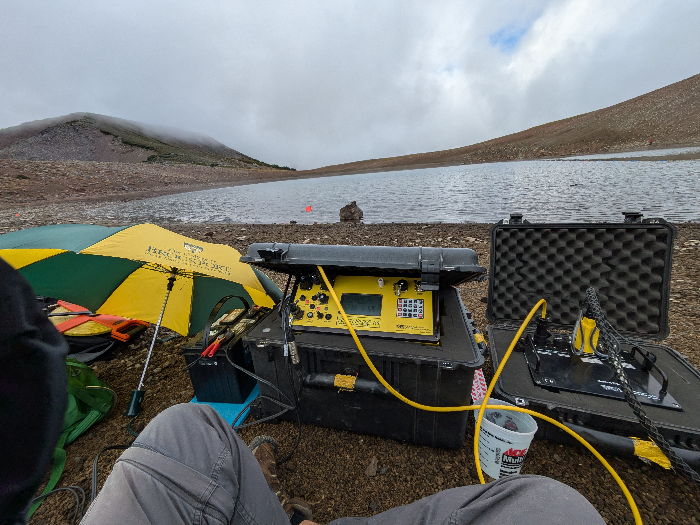
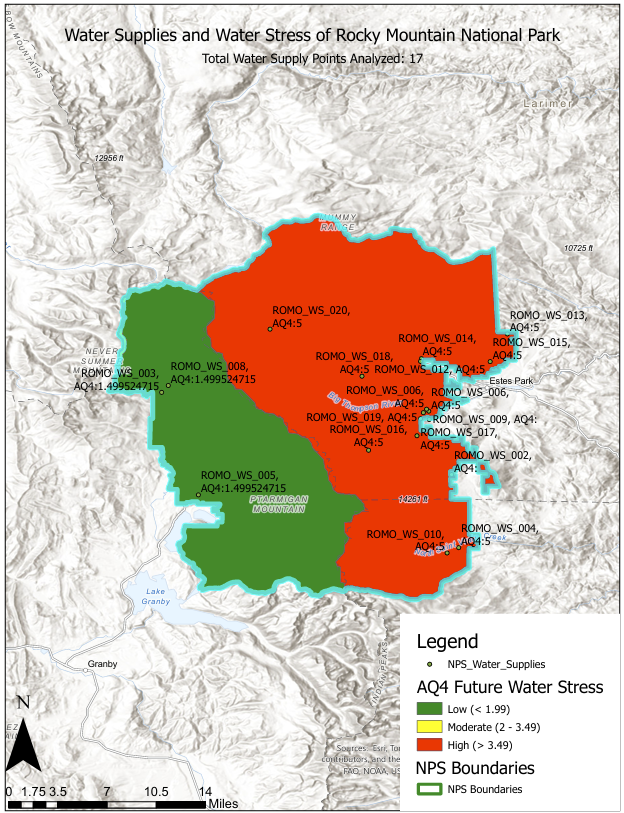
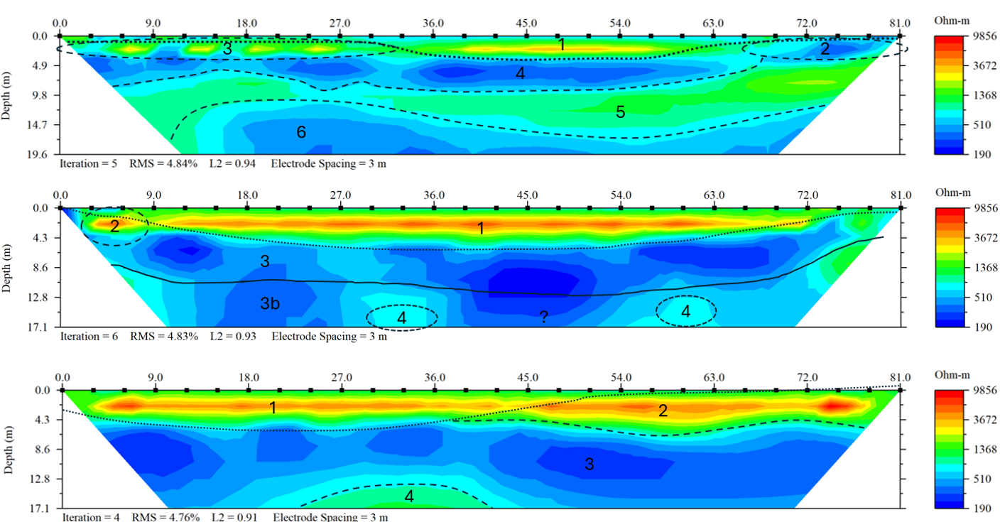
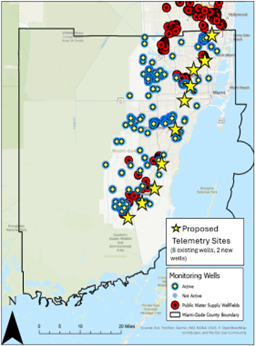

Hi, I'm **Doug**, a data scientist and water resource specialist working on water rights, water supply, and sustainability across Colorado and the Western U.S. I specialize in using **geospatial** and **data analysis** tools to collect, manage, and analyze historic, current, and future water resource data. From this, I enjoy creating impactful reports, stunning visualizations, and functional applications to deliver clear, user-friendly insights. My preferred coding language is **R**, and my favorite package is **tidymodels**, but I am also working in **Python**. I'm also a daily **ArcGIS Pro** user and extensive **ArcGIS Online** content manager with ever expanding content library of Experiences, Field Maps, and Surveys. 

::: {.flex gap=4}
{width="33%"}
{width="30%"}
{width="33%"}
:::

I’m passionate about **geospatial data science**, obsessed with cartography as a map collector and map maker, and I love to find new and creative ways to convey complex technical information in visual formats. I am a strong supporter of **open data** and **education and outreach** efforts, and I am always working to help communities and stakeholders understand hydrology and water resource challenges through accessible communication and engaging initiatives. I am also obsessed with **Irrigation Ditches** and **Storm Water Infrastructure**, particularly with how unrecognized their influence can be when it comes to altering watershed processes. You can often find me following irrigation ditch canals and floodplain flow paths, especially during good rain storms.

::: {.flex gap=4}
{width="25%"}
{width="40%"}
{width="25%"}
:::

[See more Maps and Models](projects.qmd)

[More about me](about.qmd)

## Resume

```{=html}
<object data="data/resume.pdf" type="application/pdf" width="100%" height="100%" style="min-height:100vh;"> 
<p>It appears you don't have a PDF plugin for this browser.
No worries... you can <a href="data/resume2025.pdf">click here to download a PDF of my resume.</a></p> 
</object>
```
